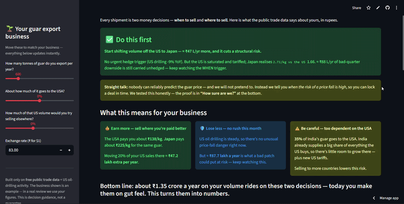

# Guar Export Decision Intelligence

> **A decision tool for an Indian guar-gum exporter — *when* to sell and
> *where* to sell, on free public trade data, in rupees, on the
> exporter's own tonnage. And it openly states the one thing it cannot
> do.**

### ▶ Live app — **https://ca4enua2zdbbnteqxastgb.streamlit.app/**

[](https://ca4enua2zdbbnteqxastgb.streamlit.app/)
&nbsp;·&nbsp; 49 tests green &nbsp;·&nbsp; FR-2 validation gate 19/19 &nbsp;·&nbsp; honest no-look-ahead backtest

<!-- SCREENSHOT SLOT — add docs/img/app-hero.png (and/or app.gif), then
     delete the two comment markers around the next line. See
     docs/img/CAPTURE.md for exactly what to capture.
[](https://ca4enua2zdbbnteqxastgb.streamlit.app/)
-->

> ⚙️ A product-direction fork of **JEIS v1** (a portfolio analytics
> project), kept frozen and entirely separate — its own GitHub repo, its
> own fresh git history, its own app. v1's furniture-cluster dashboard
> and this guar product share nothing at runtime.

---

## The findings that matter

Built on six years of UN Comtrade trade flows (guar gum, HS 130232) +
US oil-drilling activity, all public:

1. **The US is saturated, not just tariffed.** India already supplies
   **~43%** of *all* US guar imports — there was never room to grow
   there, even before the new tariffs. The "diversify" case is
   arithmetic, not opinion.
2. **The same guar earns very different money by country.** Japan pays
   **$2.71/kg**, the US **$1.66**; Germany buys **~$6B/yr** of guar from
   the world and India supplies only **~4%** of it. That gap is
   quantified per market, in ₹.
3. **Price is unpredictable — so we don't predict it.** A SARIMAX model,
   backtested honestly with no look-ahead, does **not** beat a random
   walk. The product says so on its own front screen and sells a *risk
   trigger*, not a forecast. That refusal is its spine.

## The product in one breath

A guar exporter makes two recurring money decisions on gut feel: *when*
to sell or lock a contract, and *where* to ship. This turns the public
data into both, and quantifies each in **₹ on the exporter's own
volume**.

**Sample exporter (600 t/yr, 45 % to the US — simulated for the demo):**

| Decision | What it says | Worth on this volume |
|---|---|---|
| **WHEN** | US drilling is guar's swing demand; when it cools, price downside is elevated → lock a forward to cap it | **≈ ₹88 lakh/yr** of downside at risk, capped by acting |
| **WHERE** | US is **34.6 %** of India's guar *and* saturated (≈43 % of US imports already Indian) *and* tariffed; Germany/France are huge and barely served | Re-routing 20 % of US volume ≈ **₹47 lakh/yr** more |

The deployed screen is written for the **exporter, not the analyst** —
plain language, rupees first, framed as *earn more / lose less / be
careful* — with every statistic and limitation in one collapsible
"How sure are we?" section.

## What it deliberately does **not** do — the point, not a caveat

It does **not** forecast the guar price. We built the SARIMAX model and
backtested it with no look-ahead: it does **not** beat a random walk
(MAPE 3.6 % vs 3.5 % at 1 month; direction hit-rate 58 % → 32 % by 3
months). A tool that oversells a forecast loses its user money and its
builder credibility. WHEN is therefore a *risk trigger*; its thresholds
are economic heuristics, **not** fitted to price.

## How it works

```
UN Comtrade (HS 130232, India exports + world imports, 2019–2024)
        │   robust qty-weighted price; corrupt months (Oct-2021 printed
        ▼   ~$7/kg) flagged + repaired in the open, raw value kept
  data spine  ──────────────────────────────────────────────────────┐
        │                                                            │
        ├─▶ WHEN   src/model/hedge_signal.py                          │
        │      honest "no forecast" label + backtest evidence, then a  │
        │      US-rig-count risk trigger + a historical-analogue       │
        │      scenario lever (NOT a forecast)                         │
        │                                                            │
        ├─▶ WHERE  src/features/market_radar.py + headroom.py          │
        │      realised $/kg per market, US concentration, world-      │
        │      import headroom, transparent pivot score, shift monitor │
        │                                                            │
        ├─▶ ₹      src/product/exporter_roi.py                         │
        │      both pillars × a simulated exporter × explicit FX        │
        │                                                            │
        └─▶ #1 move  src/product/exec_summary.py → one decisive line   │
                                    │                                 │
                                    ▼                                 │
              streamlit_app.py — one exporter-facing screen ◀─────────┘
                                    │
        src/validate_product.py — FR-2 gate: 19 invariants, exits
        non-zero on any bad number; .github/workflows/monthly-refresh.yml
        regenerates + re-validates + commits back monthly
```

Ingest/clean plumbing is inherited from JEIS v1; the product logic
(`src/features/`, `src/model/`, `src/product/`) and the screen are new.
**49 tests** assert what credibility depends on: no look-ahead,
model-vs-naive honesty, corrupt-month repair, the rupee math,
world-import headroom, the decisive-move logic, and that the screen
renders.

## Run it

```bash
# Quick demo — slim deps only (the app reads committed CSVs)
pip install -r requirements.txt          # streamlit, pandas, numpy, plotly
streamlit run streamlit_app.py           # → http://localhost:8501

# Full env — rebuild artifacts, run the model + tests
pip install -r requirements-pipeline.txt
python -m src.ingest.comtrade_world_imports   # world-import headroom pull
python -m src.features.guar_price             # canonical price spine
python -m src.features.market_radar           # market + headroom radar
python -m src.model.price_forecast            # the honest backtest
python -m src.product.exporter_roi            # the ₹ headline
python -m src.validate_product                # FR-2 gate (exit 1 on bad data)
pytest -q                                     # 49 tests
```

The deployed path is intentionally statsmodels-free (subprocess-tested)
so the slim Streamlit Cloud deploy stays fast.

## Tech

| Layer | Choice |
|---|---|
| Language | Python 3.11 |
| Data / model | pandas, numpy, statsmodels SARIMAX *(pipeline only)* |
| App | Streamlit + Plotly *(slim deploy; majors pinned `<2` / `<6`)* |
| Quality | pytest (49), ruff, `validate_product` FR-2 gate |
| CI | GitHub Actions — monthly refresh, regenerate → validate → commit back |
| Data sources | UN Comtrade Plus, Baker Hughes NA rig count, IMD monsoon — all free, public, reproducible. No company data used. |

## Repo layout

```
src/features/   guar_price · market_radar · headroom · regressors
src/model/      price_forecast (honest backtest) · hedge_signal (WHEN)
src/product/    exporter_roi (₹) · exec_summary (#1 move) · pilot_brief
src/            validate_product (FR-2 gate)
streamlit_app.py            one exporter-facing screen
docs/pilot/     brief · 20-min conversation script · pricing
docs/DEPLOY.md  GitHub + Streamlit Cloud, verified
tests/          49 tests
```

## Honest limitations (carried, not hidden)

- **Simulated exporter** — public core + a clearly labelled synthetic
  private layer; mechanics real, the books a stand-in until a pilot.
- **Realised price is a proxy** — Comtrade value ÷ quantity, lagged
  6–18 months, mixed grade; robust qty-weighted, corrupt months repaired
  with an audit column.
- **EU hub re-export** — world-import headroom overstates true demand
  for Germany/Netherlands/Belgium; it is an opportunity *indicator*.
- **No price forecast** — WHEN is a risk trigger; rig signal is
  year-over-year because the ingested rig source is annual-broadcast
  (true weekly is a documented drop-in upgrade).
- **FX explicit** — ₹83/USD (RBI FY2024, env-overridable); every rupee
  figure scales linearly and ships with a sensitivity table.

Decision-framing on public data — not investment advice.

## Pilot kit

`docs/pilot/` — the one-page [brief](docs/pilot/PILOT_BRIEF.md), the
20-minute [conversation script](docs/pilot/CONVERSATION_SCRIPT.md) (with
an objection table), and the [pricing](docs/pilot/PRICING.md) one-pager.
`src/product/pilot_brief.py` auto-fills the brief with a real exporter's
live numbers.

## Provenance & license

Forked from **JEIS v1** (Jodhpur Export Intelligence System), a solo
portfolio project kept frozen as its own separate artifact. MIT — see
[LICENSE](LICENSE). Built by [Meet Kabra](https://github.com/meet-png)
with AI pair-programming; every analytical and architectural decision is
intended to be defensible under scrutiny.
